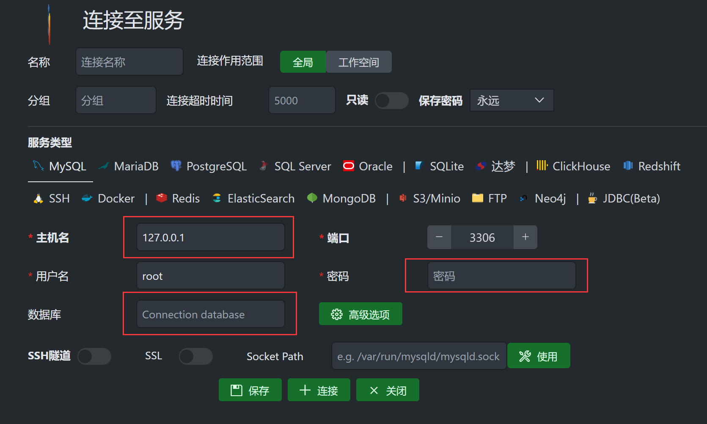

# 数据库开发环境配置

## 服务器

1. 建议使用系统ubuntu22
2. 修改主机密码
3. 确保开启端口80，3306，22

## 安装docker

参考文档[https://docs.docker.com/engine/install/ubuntu/](https://docs.docker.com/engine/install/ubuntu/)

```shell
# 1. 卸载老版本
sudo apt-get remove docker docker-engine docker.io containerd runc

# 2. 更新apt的包索引，第二句话时安装key验证工具和相关工具
sudo apt-get update
sudo apt-get install \
    ca-certificates \
    curl \
    gnupg \
    lsb-release

# 3. 添加docker官方的GPGkey
sudo mkdir -p /etc/apt/keyrings
curl -fsSL https://download.docker.com/linux/ubuntu/gpg | sudo gpg --dearmor -o /etc/apt/keyrings/docker.gpg

# 4. 再次更新apt索引
sudo apt-get update

# 5. 直接安装docker
sudo apt-get install docker-ce docker-ce-cli containerd.io docker-compose-plugin

# 6.验证
# 运行 hello-word 的镜像，打印欢迎消息
sudo docker run hello-world
```

## 启动mysql容器

官方镜像参考地址[https://hub.docker.com/_/mysql](https://hub.docker.com/_/mysql)

```shell
# 1. 通过docker拉取mysql镜像
sudo docker pull mysql

# 2.运行mysql
# --name 给容器取名为nodejs-mysql
# -e 配置参数意思为 初始化mysqlroot用户密码为123456
# -d 以守护进程的方式后台运行容器
# -p 制定端口映射，[localhost-prot:container-port], 将本机的3306端口映射到容器的3306端口
# 使用mysql镜像启动容器
sudo docker run --name nodejs-mysql -e MYSQL_ROOT_PASSWORD=123456 -d -p 3306:3306 mysql

# 3. 查看运行状态
# 看到STATUS列为up状态即运行成功
sudo docker ps -a

# 4. 登录到容器内部
sudo docker exec -it nodejs-mysql bash

# 5.连接mysql
mysql -u root -p
# 直接输入密码123456

# 6.为root用户配置任意ip地址可以连接
# 因为root用户配置信息存储在user表中，而user表是mysql这个数据库中的
# 所以，首先确认使用mysql数据库
use mysql;
# '123456'为密码
alter user 'root'@'%' identified with mysql_native_password by '123456';
# 创建一个user数据库
create database user;

# 7.退出mysql终端和nodejs-mysql容器
exit
exit
```

## 使用vscode插件，连接数据库

1. 在vscode中搜索插件，如下


2. 写上连接信息




